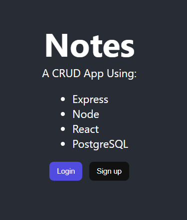
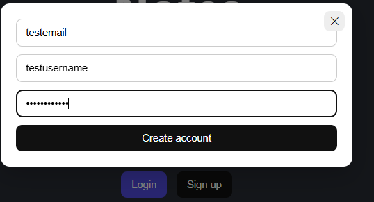
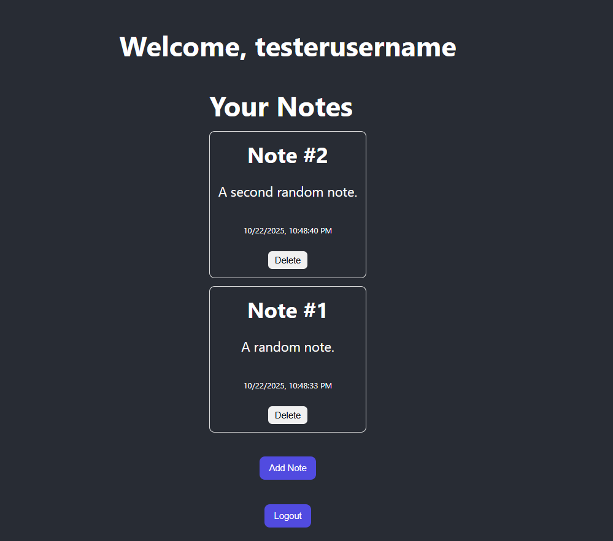

# Notes App
## A CRUD app using PostgreSQL, React, Node, Express

### Auth
Stateless, token-based API. Passwords are hashed with bcrypt.

Login issues a JWT. Middleware verifies the token.

### Routes
/auth/signup

/auth/login

/notes "GET" *To get all notes from a userId, userId pulled from auth*

/notes "POST" 

/notes/:id "DELETE"

login/signup are public, everything else is protected

### Splash page

### Signup page

### Notes Area
